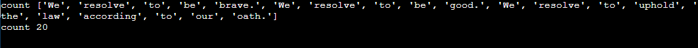
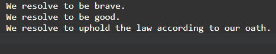

# Word-count
## AIM:
To write a python program for getting the word count from a text.
## EQUIPEMENT'S REQUIRED: 
PC
Anaconda - Python 3.7
## ALGORITHM: 
Step 1:
Open flie in read mode.

Step 2:
Read the text using read funcion.

Step 3:
Split the text using space separator.

Step 4:
The length of the split list should be equal to the number of words in the text file.

Step 5:
Now give print().

Step 6:
End the program.

## PROGRAM:
```
with open("file1.txt","r") as fp:
    A=fp.read()
    count=0
    W=A.split()
    for i in W:
        count+=1 
print("count",W)        
print("count",count)        

```

### OUTPUT:



## RESULT:
Thus the program is written to find the word count from a text.
